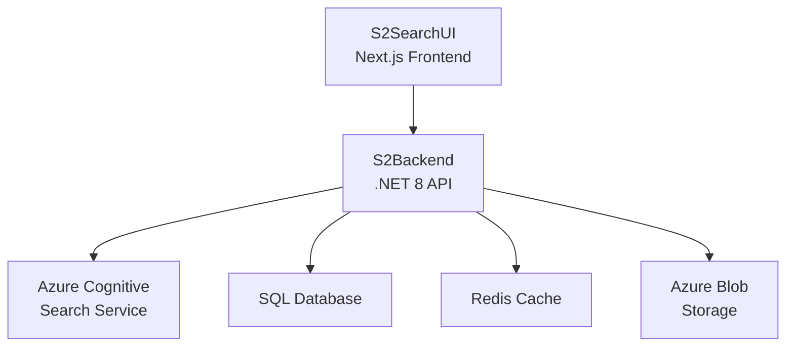

# S2Search - Helm Chart for Local Development

A production-ready Helm chart for deploying S2Search platform to local Kubernetes environments. This chart provides a simplified, yet powerful deployment solution with configurable values and best practices for container orchestration.

## 🚀 Overview

This Helm chart deploys the core S2Search components:

- **S2Backend** - .NET 8 Search API with Azure Cognitive Services integration
- **S2SearchUI** - Next.js TypeScript frontend for vehicle search interface
- **ConfigMaps** - Environment-specific configuration management
- **Services** - Internal and external service exposure
- **Container Registry Integration** - GitHub Container Registry (GHCR) support

## 📁 Chart Structure

```
S2Search/
├── Chart.yaml                           # 📋 Chart metadata and version info
├── values.yaml                          # ⚙️ Default configuration values
├── templates/                           # 🎯 Kubernetes resource templates
│   ├── S2Backend/                      # Backend API resources
│   │   ├── ConfigMaps/
│   │   │   └── configmap-localk8s.yml  # Backend configuration
│   │   ├── deployment.yml              # Backend deployment
│   │   ├── service-clusterip.yml       # Internal service
│   │   └── service-loadbalancer.yml    # External service
│   └── S2earchUi/                      # Frontend UI resources
│       ├── ConfigMaps/
│       │   └── configmap-ui-env.yml    # UI environment variables
│       ├── deployment.yml              # UI deployment
│       └── service-loadbalancer.yml    # UI service
└── README.md                           # This documentation
```

## 🛠️ Prerequisites

### Required Software

- **Kubernetes Cluster** - v1.19+ (Docker Desktop, Minikube, or Kind)
- **Helm** - v3.8+ ([Installation Guide](https://helm.sh/docs/intro/install/))
- **kubectl** - Configured with cluster access
- **Docker** - For local image building (optional)

### Container Registry Access

The chart uses GitHub Container Registry (GHCR). Ensure you have:

```bash
# Create secret for GHCR access
kubectl create secret docker-registry ghcr-secret \
  --docker-server=ghcr.io \
  --docker-username=<your-github-username> \
  --docker-password=<your-github-token> \
  --docker-email=<your-email>
```

### System Resources

**Minimum Requirements:**

- **CPU**: 2 cores
- **RAM**: 4GB
- **Storage**: 10GB

**Recommended:**

- **CPU**: 4 cores
- **RAM**: 8GB
- **Storage**: 20GB

## ⚡ Quick Start

### 1. Install Chart

```bash
# Add namespace (optional but recommended)
kubectl create namespace s2search

# Install chart with default values
helm install s2search . -n s2search

# Or install with custom values
helm install s2search . -n s2search -f custom-values.yaml
```

### 2. Verify Deployment

```bash
# Check deployment status
helm status s2search -n s2search

# Watch pods come online
kubectl get pods -n s2search -w

# Check services
kubectl get svc -n s2search
```

### 3. Access Applications

```bash
# Get LoadBalancer IPs (if using LoadBalancer services)
kubectl get svc -n s2search

# Port forward for local access
kubectl port-forward svc/s2searchui-service 3000:80 -n s2search
kubectl port-forward svc/search-api-service 8080:80 -n s2search
```

**Access URLs:**

- **Search UI**: http://localhost:3000
- **Backend API**: http://localhost:8080/swagger

## 🔧 Configuration

### Default Values

The `values.yaml` file contains all configurable parameters:

```yaml
# Backend API Configuration
S2Backend:
  replicaCount: 1
  image:
    repository: ghcr.io/square2digital/s2search-backend
    tag: latest
    pullPolicy: IfNotPresent
  service:
    type: ClusterIP
    port: 80
  resources:
    limits:
      cpu: 500m
      memory: 512Mi
    requests:
      cpu: 250m
      memory: 256Mi

# Frontend UI Configuration
S2SearchUi:
  replicaCount: 1
  image:
    repository: ghcr.io/square2digital/s2search-ui
    tag: latest
    pullPolicy: IfNotPresent
  service:
    type: LoadBalancer
    port: 80
  resources:
    limits:
      cpu: 300m
      memory: 256Mi
    requests:
      cpu: 100m
      memory: 128Mi
```

### Custom Values File

Create a `custom-values.yaml` for environment-specific configurations:

```yaml
# custom-values.yaml
S2Backend:
  replicaCount: 2
  image:
    tag: "v1.2.0"
  resources:
    limits:
      cpu: 1000m
      memory: 1Gi
    requests:
      cpu: 500m
      memory: 512Mi
  env:
    ASPNETCORE_ENVIRONMENT: "Development"

S2SearchUi:
  replicaCount: 2
  image:
    tag: "v1.2.0"
  service:
    type: NodePort
```

### Environment Variables

#### Backend Environment Variables

Configured in `templates/S2Backend/ConfigMaps/configmap-localk8s.yml`:

```yaml
# Key configuration settings
ConnectionStrings:
  SqlDatabase: "Server=tcp:s2-sql-dev.database.windows.net..."
  AzureStorage: "DefaultEndpointsProtocol=https;AccountName=s2storagedev..."
  Redis: "redis:6379,ssl=false,abortConnect=false"

DemoSearchCredentials:
  UseDemoSearchCredentials: true
  SearchCredentialsIndexName: "s2-demo-vehicles"
  SearchCredentialsInstanceEndpoint: "https://s2-search-dev.search.windows.net"

SearchSettings:
  DefaultSearchOrderBy: "price desc"
  FacetOrder: ["make", "model", "variant", "price", "monthlyPrice"]
```

#### Frontend Environment Variables

Configured in `templates/S2earchUi/ConfigMaps/configmap-ui-env.yml`:

```yaml
# UI configuration
NEXT_PUBLIC_DEFAULT_PAGE_SIZE: "24"
NEXT_PUBLIC_SEARCH_API_ENDPOINT: "/v1/search"
NEXT_PUBLIC_FACET_API_ENDPOINT: "/v1/facet"
NEXT_PUBLIC_SEARCH_API_URL: "http://s2search-api-service"
NEXT_PUBLIC_THEME_PRIMARY_COLOUR: "#616161"
NEXT_PUBLIC_THEME_SECONDARY_COLOUR: "#303f9f"
NEXT_PUBLIC_PLACEHOLDER_TEXT_1: "Lexus blue 2012..."
```

## 🏗️ Architecture

### Service Architecture



### Kubernetes Resources

#### Deployments

**S2Backend Deployment:**

- **Replicas**: Configurable (default: 1)
- **Strategy**: RollingUpdate with maxUnavailable: 1, maxSurge: 1
- **Health Checks**: Liveness and readiness probes on `/api/SearchStatus`
- **Security**: Non-root user execution (UID 1000)
- **Configuration**: ConfigMap-based application settings

**S2SearchUI Deployment:**

- **Replicas**: Configurable (default: 1)
- **Strategy**: RollingUpdate for zero-downtime deployments
- **Health Checks**: Liveness probe on `/vehicletest`
- **Configuration**: Environment variables via ConfigMap

#### Services

**search-api-service (ClusterIP):**

- Internal service for backend API
- Port 80 → Backend container port 80
- Used by frontend for API communication

**s2searchui-service (LoadBalancer):**

- External service for frontend access
- Port 80 → Frontend container port 3000
- Provides external access to the search interface

#### ConfigMaps

**searchapi-appsettings-localk8s:**

- Complete `appsettings.json` configuration
- Database connection strings
- Azure services configuration
- Search and caching settings

**s2searchui-env:**

- Next.js environment variables
- API endpoint configurations
- Theme and UI customization

## 🎯 Deployment Scenarios

### Development Environment

```bash
# Deploy with debug settings
helm install s2search . -n s2search \
  --set S2Backend.env.ASPNETCORE_ENVIRONMENT=Development \
  --set S2Backend.resources.limits.cpu=1000m \
  --set S2SearchUi.service.type=NodePort
```

### Production Environment

```bash
# Deploy with production settings
helm install s2search . -n s2search \
  --set S2Backend.replicaCount=3 \
  --set S2SearchUi.replicaCount=2 \
  --set S2Backend.image.tag=v1.2.0 \
  --set S2SearchUi.image.tag=v1.2.0
```

### Load Testing Environment

```bash
# Deploy with higher resource limits
helm install s2search . -n s2search \
  --set S2Backend.replicaCount=5 \
  --set S2Backend.resources.limits.cpu=2000m \
  --set S2Backend.resources.limits.memory=2Gi
```

## 📊 Monitoring & Health Checks

### Health Check Endpoints

**Backend API Health Checks:**

- **Endpoint**: `/api/SearchStatus`
- **Liveness Probe**: 15s initial delay, 10s period
- **Readiness Probe**: 15s initial delay, 10s period

**Frontend Health Checks:**

- **Endpoint**: `/vehicletest`
- **Liveness Probe**: 15s initial delay, 10s period

### Resource Monitoring

```bash
# Monitor resource usage
kubectl top pods -n s2search
kubectl top nodes

# Watch deployment status
kubectl get deployment -n s2search -w

# Check pod logs
kubectl logs -f deployment/s2search-backend-deployment -n s2search
kubectl logs -f deployment/s2searchui-deployment -n s2search
```

### Performance Metrics

**Backend API Metrics:**

- **CPU Request**: 250m (25% of 1 core)
- **CPU Limit**: 500m (50% of 1 core)
- **Memory Request**: 256Mi
- **Memory Limit**: 512Mi

**Frontend UI Metrics:**

- **CPU Request**: 100m (10% of 1 core)
- **CPU Limit**: 300m (30% of 1 core)
- **Memory Request**: 128Mi
- **Memory Limit**: 256Mi

## 🔄 Lifecycle Management

### Installation

```bash
# Install chart
helm install s2search . -n s2search

# Install with custom values
helm install s2search . -n s2search -f production-values.yaml

# Install and wait for readiness
helm install s2search . -n s2search --wait --timeout=10m
```

### Upgrades

```bash
# Upgrade with new image tags
helm upgrade s2search . -n s2search \
  --set S2Backend.image.tag=v1.3.0 \
  --set S2SearchUi.image.tag=v1.3.0

# Upgrade with new values file
helm upgrade s2search . -n s2search -f updated-values.yaml

# Rollback to previous version
helm rollback s2search 1 -n s2search
```

### Scaling

```bash
# Scale backend replicas
helm upgrade s2search . -n s2search --set S2Backend.replicaCount=5

# Scale frontend replicas
helm upgrade s2search . -n s2search --set S2SearchUi.replicaCount=3

# Scale both services
kubectl scale deployment s2search-backend-deployment --replicas=5 -n s2search
kubectl scale deployment s2searchui-deployment --replicas=3 -n s2search
```

### Uninstallation

```bash
# Uninstall chart
helm uninstall s2search -n s2search

# Remove namespace (optional)
kubectl delete namespace s2search
```

## 🐛 Troubleshooting

### Common Issues

#### Pod Startup Failures

```bash
# Check pod events
kubectl describe pod <pod-name> -n s2search

# Check container logs
kubectl logs <pod-name> -c <container-name> -n s2search

# Check ConfigMap
kubectl get configmap searchapi-appsettings-localk8s -o yaml -n s2search
```

#### Image Pull Errors

```bash
# Verify secret exists
kubectl get secret ghcr-secret -n s2search

# Check secret configuration
kubectl describe secret ghcr-secret -n s2search

# Recreate secret if needed
kubectl delete secret ghcr-secret -n s2search
kubectl create secret docker-registry ghcr-secret \
  --docker-server=ghcr.io \
  --docker-username=<username> \
  --docker-password=<token> \
  --docker-email=<email> \
  -n s2search
```

#### Service Connectivity Issues

```bash
# Test internal service connectivity
kubectl exec -it <backend-pod> -n s2search -- curl http://s2search-api-service/api/SearchStatus

# Check service endpoints
kubectl get endpoints -n s2search

# Test external service access
kubectl port-forward svc/s2searchui-service 3000:80 -n s2search
```

#### Configuration Issues

```bash
# Check ConfigMap contents
kubectl get configmap searchapi-appsettings-localk8s -o json -n s2search

# Update ConfigMap
kubectl create configmap searchapi-appsettings-localk8s \
  --from-file=appsettings.json --dry-run=client -o yaml | \
  kubectl apply -f - -n s2search

# Restart deployments to pick up changes
kubectl rollout restart deployment/s2search-backend-deployment -n s2search
```

### Debug Commands

```bash
# Get all resources
kubectl get all -n s2search

# Check Helm release status
helm status s2search -n s2search

# View Helm release history
helm history s2search -n s2search

# Debug template rendering
helm template s2search . --debug

# Validate chart
helm lint .
```

## 🚀 Advanced Configuration

### Custom Resource Limits

```yaml
# high-performance-values.yaml
S2Backend:
  resources:
    limits:
      cpu: 2000m
      memory: 4Gi
    requests:
      cpu: 1000m
      memory: 2Gi

S2SearchUi:
  resources:
    limits:
      cpu: 1000m
      memory: 1Gi
    requests:
      cpu: 500m
      memory: 512Mi
```

### Node Affinity and Tolerations

```yaml
# node-specific-values.yaml
S2Backend:
  nodeSelector:
    kubernetes.io/arch: amd64
  tolerations:
    - key: "node-type"
      operator: "Equal"
      value: "compute"
      effect: "NoSchedule"
  affinity:
    nodeAffinity:
      requiredDuringSchedulingIgnoredDuringExecution:
        nodeSelectorTerms:
          - matchExpressions:
              - key: node-type
                operator: In
                values: ["compute", "memory-optimized"]
```

### Ingress Configuration

```yaml
# ingress-values.yaml
ingress:
  enabled: true
  annotations:
    kubernetes.io/ingress.class: "nginx"
    cert-manager.io/cluster-issuer: "letsencrypt-prod"
  hosts:
    - host: search.yourdomain.com
      paths:
        - path: /
          pathType: Prefix
          service:
            name: s2searchui-service
            port: 80
    - host: api.yourdomain.com
      paths:
        - path: /
          pathType: Prefix
          service:
            name: search-api-service
            port: 80
  tls:
    - secretName: search-tls
      hosts:
        - search.yourdomain.com
        - api.yourdomain.com
```

## 📚 Development Workflow

### Local Development with Helm

1. **Make code changes** in your local development environment
2. **Build new images** (if needed):
   ```bash
   docker build -t ghcr.io/square2digital/s2search-backend:dev .
   docker build -t ghcr.io/square2digital/s2search-ui:dev .
   ```
3. **Update chart values** for development:
   ```bash
   helm upgrade s2search . -n s2search \
     --set S2Backend.image.tag=dev \
     --set S2SearchUi.image.tag=dev
   ```
4. **Test changes** via port forwarding or LoadBalancer
5. **Check logs** for any issues

### Configuration Updates

1. **Modify ConfigMaps** in `templates/*/ConfigMaps/`
2. **Apply changes**:
   ```bash
   helm upgrade s2search . -n s2search
   ```
3. **Restart deployments** if needed:
   ```bash
   kubectl rollout restart deployment -n s2search
   ```

## 🔗 Integration with CI/CD

### GitHub Actions Integration

```yaml
# .github/workflows/deploy-helm.yml
name: Deploy with Helm
on:
  push:
    branches: [main]

jobs:
  deploy:
    runs-on: ubuntu-latest
    steps:
      - uses: actions/checkout@v3

      - name: Install Helm
        uses: azure/setup-helm@v3
        with:
          version: "3.10.0"

      - name: Deploy to Kubernetes
        run: |
          helm upgrade --install s2search ./K8s/Helm/Local \
            --namespace s2search \
            --set S2Backend.image.tag=${{ github.sha }} \
            --set S2SearchUi.image.tag=${{ github.sha }}
```

### ArgoCD Integration

```yaml
# argocd-application.yaml
apiVersion: argoproj.io/v1alpha1
kind: Application
metadata:
  name: s2search
  namespace: argocd
spec:
  project: default
  source:
    repoURL: https://github.com/square2digital/S2Search
    targetRevision: HEAD
    path: K8s/Helm/Local
    helm:
      valueFiles:
        - values.yaml
        - production-values.yaml
  destination:
    server: https://kubernetes.default.svc
    namespace: s2search
  syncPolicy:
    automated:
      prune: true
      selfHeal: true
```

## 📄 Chart Information

### Chart Metadata

- **Name**: S2Search
- **Version**: 0.1.0
- **App Version**: 1.0.0
- **Type**: application
- **API Version**: v2

### Supported Kubernetes Versions

- **Minimum**: v1.19
- **Tested**: v1.25, v1.26, v1.27
- **Recommended**: v1.26+

## 🤝 Contributing

1. **Test changes locally** using this Helm chart
2. **Update chart version** in `Chart.yaml` for breaking changes
3. **Update documentation** for new configuration options
4. **Validate templates** with `helm lint`
5. **Test installation** in clean namespace

## 📄 License

This project is proprietary software. See [LICENSE](../../../LICENSE) for details.

## 🔗 Related Documentation

- [Legacy K8s Environment](../../Legacy/K8s.Local.Development.Environment/README.md)
- [Main S2Search Documentation](../../../README.md)
- [Backend APIs](../../../APIs/README.md)
- [Frontend Applications](../../../UIs/README.md)

---

_Built for enterprise-scale deployment with Helm and Kubernetes_
